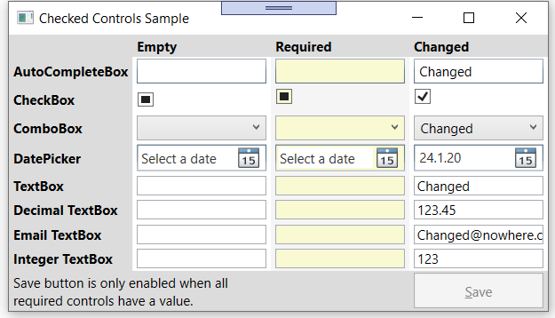

# WpfWindowsLib: Library with basic WPF Window functionality

## About

When the user can enter some data on a Window, quite a bit of code is needed 
to decide if any data has been changed, i.e. the save button should be
enabled and to check if all required data is entered. The controls in this
library detect themselves if there was a change and inform the window
automatically.

Few other methods are in this library, which are helpful when writing
WPF applications, like `GlyphDrawer` which allows to measure text length and
writing text directly to a DrawingContext.

## Sample Application

The project `SampleApp` shows the various controls available and demonstrates
how the user will interact with them:

 There are 3 columns. The first shows controls with no data, the second controls
with no data, but the user has to fill in some data because they are required for 
saving and the third column shows control with some initial data.

The Save button gets only enabled once the user has entered some data for 
all required controls. If he tries to close the window before doing so, a warning
message gets displayed. If everything is saved, but 1 control gets changed 
again, the same thing happens. The user needs to save before he can close the
window.

## Coding

A control has to implement `ICheck`. It can then be placed in a Window inheriting
from `CheckedWindow`. The initial value and setting `IsRequired` is done from
code behind:

    RequiredDecimalTextBox.Init(1.23, isRequired: true);

The controls implementing `ICheck` will automatically search for the parent
`CheckedWindow`, register with it and inform it if their `HasChanged` or 
`IsAvailablev` property has changed. `CheckedWindow` checks all other controls 
and calls `OnICheckChanged`or `OnIsAvailableChanged` as needed.
## Build requirements

.Net Core 3.1 or later

## Copyright

Copyright 2020 Jürg Peter Huber, Singapore.

Licensed under the [Creative Commons 0 license](COPYING.txt)

